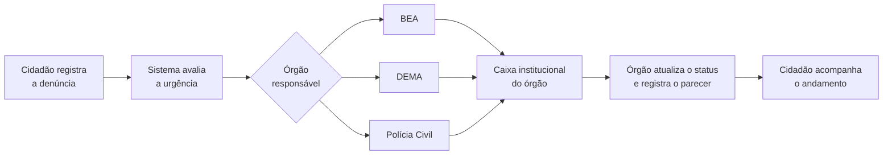

# PetSOS Web

Canal web para denunciar maus-tratos contra animais pelo navegador, sem instalar aplicativo. As denúncias são registradas com fotos e localização e, nas próximas sprints, serão encaminhadas aos órgãos parceiros: **BEA**, **DEMA** e **Polícia Civil**.

> Projeto de extensão, IFMT, 9º semestre.

**Versão atual:** Sprint 1 ✅ · Sprint 2 em desenvolvimento no branch [`sprint-2`](../../tree/sprint-2)

---

## Visão do produto

> Para **cidadãos que precisam denunciar maus-tratos contra animais** de forma rápida, sem instalar um aplicativo, o **PetSOS Web** é uma **plataforma colaborativa de proteção animal** que permite registrar e acompanhar denúncias com evidências e localização direto do navegador.
>
> Diferente da versão mobile do PetSOS, feita para uso contínuo e engajamento da comunidade, o nosso produto é um **canal de acesso rápido e simplificado**. Ele amplia o alcance da causa ao **encaminhar os casos registrados diretamente aos órgãos parceiros (BEA, DEMA e Polícia Civil)**, agilizando a resposta institucional.

### PetSOS mobile x PetSOS Web

| | PetSOS (app mobile) | PetSOS Web |
| --- | --- | --- |
| **Uso** | Contínuo, engajamento da comunidade | Rápido e pontual |
| **Acesso** | Instalar o aplicativo | Direto pelo navegador |
| **Foco** | Comunidade: seguir, voluntariar, comentar | Registrar a denúncia e fazê-la chegar a quem pode agir |
| **Diferencial** | Rede colaborativa | Encaminhamento aos órgãos parceiros |

Os dois usam a mesma API e o mesmo banco. Uma denúncia registrada no site também aparece no app, e vice-versa.

### Fluxo da denúncia

O que o produto vai fazer quando o backlog estiver completo:



1. **Registro:** o cidadão descreve o caso, anexa fotos e marca o local no mapa.
2. **Urgência:** a urgência é definida a partir das informações da denúncia (tipo, descrição e evidências).
3. **Encaminhamento:** o caso vai para o órgão responsável (BEA, DEMA ou Polícia Civil).
4. **Caixa institucional:** cada órgão tem uma página própria e vê **somente** as denúncias encaminhadas a ele.
5. **Retorno:** o órgão atualiza o status e registra o parecer oficial, que o cidadão acompanha pelo site.

---

## Backlog

**6 épicos, 17 histórias, 4 sprints.**

Legenda: ✅ concluída · 🚧 em desenvolvimento · 📋 planejada

### Épico 1: Registro de denúncias

| Story | Descrição | Sprint | Prioridade | Status |
| --- | --- | :---: | :---: | :---: |
| Criar denúncia de maus-tratos | Como usuário, quero registrar uma denúncia rapidamente pelo navegador, sem precisar instalar um aplicativo. | 1 | Alta | ✅ |
| Anexar evidência da denúncia | Como usuário, quero anexar fotos como evidência. | 1 | Alta | ✅ |
| Informar localização da denúncia | Como usuário, quero indicar no mapa ou por endereço onde o caso ocorreu. | 1 | Alta | ✅ |

### Épico 2: Visualização de denúncias

| Story | Descrição | Sprint | Prioridade | Status |
| --- | --- | :---: | :---: | :---: |
| Visualizar denúncias no mapa | Como usuário, quero ver as denúncias registradas em um mapa para entender onde os casos acontecem. | 1 | Alta | ✅ |
| Abrir detalhes de uma denúncia | Como usuário, quero visualizar todos os detalhes de uma denúncia. | 2 | Alta | 🚧 |
| Filtrar denúncias | Como usuário, quero filtrar denúncias por status ou localização. | 2 | Média | 🚧 |

### Épico 3: Encaminhamento a órgãos parceiros

| Story | Descrição | Sprint | Prioridade | Status |
| --- | --- | :---: | :---: | :---: |
| Selecionar órgão responsável | Como usuário, quero indicar para qual órgão (BEA, DEMA ou Polícia Civil) a denúncia deve ser encaminhada. | 3 | Alta | 📋 |
| Visualizar status do encaminhamento | Como usuário, quero saber se a denúncia já foi enviada ao órgão responsável e qual o andamento. | 3 | Média | 📋 |
| Registrar retorno do órgão | Como usuário, quero visualizar o parecer ou retorno oficial do órgão responsável sobre a denúncia. | 4 | Média | 📋 |

### Épico 4: Acompanhamento e resolução de casos

| Story | Descrição | Sprint | Prioridade | Status |
| --- | --- | :---: | :---: | :---: |
| Atualizar status da denúncia | Como usuário ou responsável pelo caso, quero atualizar o status da denúncia para informar o andamento da resolução. | 3 | Alta | 📋 |
| Visualizar histórico de atualizações da denúncia | Como usuário, quero ver o histórico de atualizações da denúncia para acompanhar o que já foi feito no caso. | 3 | Média | 📋 |

### Épico 5: Gerenciamento de usuário

| Story | Descrição | Sprint | Prioridade | Status |
| --- | --- | :---: | :---: | :---: |
| Fazer login no sistema web | Como usuário, quero entrar no sistema web com meu email ou username para registrar denúncias. | 1 ¹ | Alta | ✅ |
| Criar conta | Como usuário, quero criar uma conta pelo navegador para poder registrar denúncias. | 1 ¹ | Alta | ✅ |
| Recuperar senha | Como usuário, quero recuperar minha senha por email caso eu a esqueça. | 2 | Baixa | 🚧 |

> ¹ **Login e cadastro foram adiantados para a Sprint 1.** A API só aceita denúncias de usuários autenticados e com email confirmado. Sem eles, a história "Criar denúncia" não poderia ser entregue.

### Épico 6: Painel institucional

| Story | Descrição | Sprint | Prioridade | Status |
| --- | --- | :---: | :---: | :---: |
| Login de órgão parceiro | Como responsável por BEA, DEMA ou Polícia Civil, quero acessar um painel próprio para visualizar as denúncias encaminhadas ao meu órgão. | 4 | Baixa | 📋 |
| Visualizar denúncias encaminhadas | Como órgão parceiro, quero ver a lista de denúncias direcionadas a mim, com evidências e localização. | 4 | Baixa | 📋 |
| Atualizar status pelo órgão parceiro | Como órgão parceiro, quero atualizar o status de uma denúncia após tomar alguma ação. | 4 | Baixa | 📋 |

### Resumo por sprint

| Sprint | Objetivo | Histórias | Status |
| :---: | --- | --- | :---: |
| **1** | Registrar e visualizar denúncias | Criar denúncia · Anexar fotos · Localização · Mapa · Login · Criar conta | ✅ |
| **2** | Explorar as denúncias | Detalhes · Filtros · Recuperar senha | 🚧 |
| **3** | Encaminhar e acompanhar | Selecionar órgão · Status do encaminhamento · Atualizar status · Histórico | 📋 |
| **4** | Painel institucional | Login do órgão · Denúncias encaminhadas · Atualizar status pelo órgão · Retorno do órgão | 📋 |

> **Sprints 3 e 4 exigem mudanças no backend.** A API atual não tem urgência, órgão responsável, encaminhamento nem papel de usuário para órgãos. A filtragem da caixa institucional precisa ser feita na API, para que um órgão nunca receba denúncias de outro.

---

## Sprint 1: o que foi entregue

| Tela | Rota | O que faz |
| --- | --- | --- |
| Mapa | `/` | Denúncias da área visível, com marcadores coloridos por status, lista lateral, busca de endereço e "minha localização". Aberto a visitantes. |
| Nova denúncia | `/denuncias/nova` | Título, tipo, animal, descrição, até 5 fotos, local (clique no mapa, busca por endereço ou GPS) e opção de denúncia anônima. |
| Login | `/login` | Entrada por email ou username. |
| Cadastro | `/cadastro` | Criação de conta, com envio de email de confirmação. |

**Regras da denúncia**, as mesmas da API: título com no mínimo 3 caracteres; tipo, animal e localização obrigatórios; pelo menos uma descrição **ou** uma foto; até 5 fotos JPG/PNG de até 8 MB. Antes do envio, as fotos são reduzidas para no máximo 1280 px e convertidas para JPEG.

---

## Tecnologias

- [React 19](https://react.dev) + [Vite 6](https://vite.dev), em JavaScript
- [React Router](https://reactrouter.com) para as rotas
- [Firebase Auth](https://firebase.google.com/docs/auth) para login e cadastro
- [Leaflet](https://leafletjs.com) + [React Leaflet](https://react-leaflet.js.org) com mapas do OpenStreetMap
- [Nominatim](https://nominatim.org) para buscar endereços e converter coordenadas em endereço

## Como rodar

**Pré-requisitos:** Node.js 20 ou mais recente, a [API](#api) rodando e as credenciais web do Firebase do projeto (as mesmas `EXPO_PUBLIC_FIREBASE_*` do app mobile).

```bash
npm install
cp .env.example .env   # e preencha com os dados do Firebase e a URL da API
npm run dev
```

Depois abra http://localhost:5173.

| Variável | Descrição |
| --- | --- |
| `VITE_API_URL` | URL base da API, ex.: `http://localhost:3030/api` |
| `VITE_UPLOAD_URL` | Servidor das fotos enviadas, ex.: `http://localhost:3030` |
| `VITE_FIREBASE_*` | Configuração web do Firebase |

O `.env` não vai para o repositório. Use o `.env.example` como modelo.

| Comando | O que faz |
| --- | --- |
| `npm run dev` | Servidor de desenvolvimento |
| `npm run build` | Gera a versão de produção em `dist/` |
| `npm run preview` | Serve localmente a versão de produção |
| `npm run lint` | Verifica o código com ESLint |

## API

O backend é o `petsos-api` (Node.js, Express e Firestore), o mesmo do app mobile. Para rodar localmente, dentro da pasta dele:

```bash
npm install
npm run dev   # porta 3030
```

A API grava os logs em `src/logger/logs/`, então o terminal fica em silêncio mesmo quando ela está funcionando. A documentação dos endpoints fica em `http://localhost:3030/api/docs`.

Endpoints usados na Sprint 1:

| Método | Rota | Uso |
| --- | --- | --- |
| `GET` | `/complaints/map` | Denúncias da área visível do mapa |
| `POST` | `/complaints` | Criar denúncia (multipart, com fotos) |
| `GET` | `/auth/check-username/:username` | Verificar se o username está livre |
| `GET` | `/auth/resolve-username/:username` | Login por username |
| `POST` | `/auth/complete-profile` | Concluir o cadastro |

## Estrutura

```
src/
  assets/        imagens (logo e ilustrações do app)
  components/    componentes reutilizáveis
    auth/        moldura das telas de login e cadastro
    complaints/  card, badges, fotos
    map/         busca de endereço, seletor de local, marcadores
  config/        inicialização do Firebase
  constants/     tipos, status, animais e configurações do mapa
  context/       AuthContext (sessão do usuário)
  hooks/         geolocalização, endereço, denúncias do mapa
  layouts/       cabeçalho e estrutura das páginas
  pages/         uma tela por rota
  services/      chamadas à API, ao Firebase e ao Nominatim
  styles/        CSS global com tema claro e escuro
  utils/         datas, imagens e fotos
  validators/    validação dos formulários
```

## Observações

- **Fotos em desenvolvimento:** a API local usa o mesmo Firestore de desenvolvimento, mas as fotos antigas ficam salvas só no servidor de produção. No lugar delas o site mostra o emoji do animal.
- **Área do mapa:** a API não aceita consultas de áreas muito grandes. Com o mapa muito afastado, o site pede para aproximar.
- **Email confirmado:** para registrar denúncias é preciso confirmar o email. O formulário mostra um aviso com as opções de reenviar o link e de verificar de novo.
